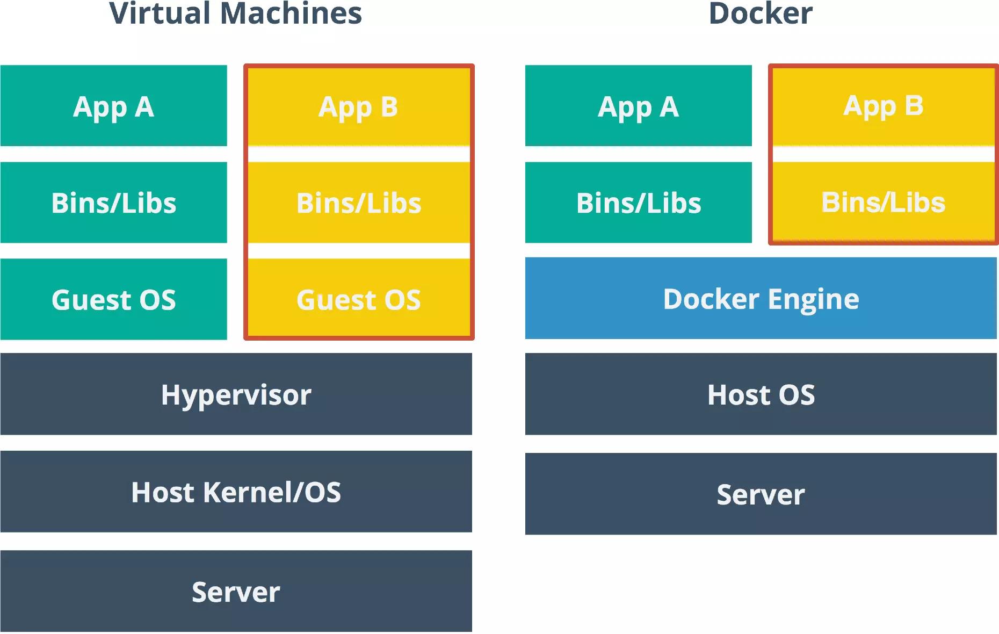

# ¿Como funciona Docker?

## ¿Qué es Docker?

Es un sistema para resolver las diferencias de software en una maquina, corrigiendo uno de las errores mas comunes que ocurren en el mundo del software que es la falta de compatibilidad entre dispositivos. El sistema de contenedores de Docker tiene todo lo necesario para que la aplicación funcione en un entorno controlado.

## Comparación entre contenedores y maquinas virtuales

A diferencia de una máquina virtual, que es una abstracción del hardware y emula toda una computadora (o servidor), un contenedor es una abstracción del software y éste puede empaquetar el código, el runtime necesario y las dependencias de una aplicación

## ¿Como funciona?

Componentes DENTRO del circulo de Docker:

- **Docker daemon:** Es el centro de docker, el corazón que gracias a el, podemos comunicarnos con los servicios de docker.
- **REST API:** Como cualquier otra API, es la que nos permite visualizar docker de forma “gráfica”.
- **Cliente de docker:** Gracias a este componente, podemos comunicarnos con el corazón de docker (Docker Daemon) que por defecto es la línea de comandos.

Dentro de la arquitectura de Docker encontramos:

1. **Contenedores:** Es la razón de ser de Docker, es donde podemos encapsular nuestras imagenes para llevarlas a otra computadora, o servidor, etc.
2. **Imagenes:** Son las encapsulaciones de x contenedor. Podemos correr nuestra aplicación en Java por medio de una imagen, podemos utilizar Ubuntu para correr nuestro proyecto, etc.
3. **Volumenes de datos:** Podemos acceder con seguridad al sistema de archivos de nuestra máquina.
4. **Redes:** Son las que permiten la comunicación entre contenedores.
