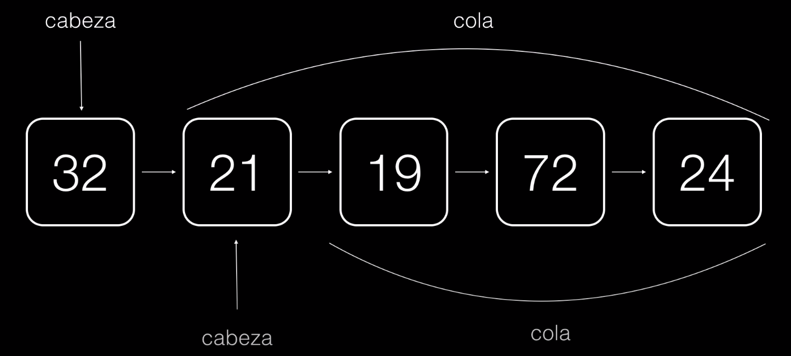
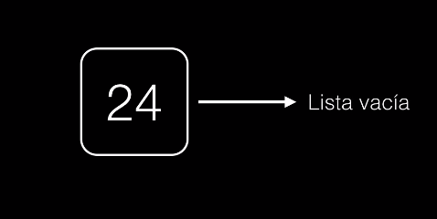

# Listas Enlazadas

Las listas enlazadas permite representar un grupo de elementos presentados en secuencia.

## Estructura

- **Cabeza:**  Es el indice incial de la lista.
- **Cola:**  Es el resto de elementos de la cabeza

El ultimo elemento apunta a la nada o a una lista vacia 

## Ventajas

- Los nodos no tienen por qué guardarse todos juntos en memoria a diferencia de los arrays.
- Pueden tener longitud variable.
- Podemos agregar y quitar elementos en tiempo de ejecución.

## Desventajas

- Las listas no tienen noción de índice, por lo que no podemos hacer accesos aleatorios.
- Necesita mas espacio en memoria.