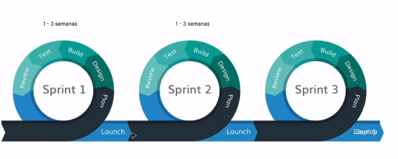

# Metodologias Agiles

## Introducción

Es un conjunto de filosofias y metodologias que ese implementan para el desarrollo de software, con el fin obtener proyectos altamente escalables y adaptativos.  
[Manifiesto por el Desarrollo Ágil de Software](https://agilemanifesto.org/iso/es/manifesto.html)

## Metodogia Agil

La mejor forma de describir los proyectos agiles es por **Sprints** que serian versiones del proyectos implemetadas de manera individual pero conectadas, permitiendo implementaciones en cortos periodos de tiempo.

## Metodologia SCRUM

Es una metodología ágil que compila buenas practicas con el fin de gestonar los proyectos de software.
Mas información en: **[Scrum](001%20Scrum.md)**

## Metodologia KANBAN

Se desarrolló en las empresas de Japón principalmente en Toyota, consiste en una serie de tableros visuales con posts o tarjetas pegables con las tareas, cada una maneja un estado y un ciclo de vida hasta el final de proceso. Un ejemplo de esta metodologia es la aplicación Trello.
Mas informacion en: **[Kanban](002%20Kanban.md)**

## Programación extrema

Se desarrollo en 1999 con la publicación del libro *Extreme Programming Explained* de Kent Beck,  es una metodología agil enfocada unicamente en el desarrollo de software,  define que los cambios a la hora de desarrollar software es algo nomal y natural.  
Mas información en **[Programacion Extrema](003%20Programacion%20Extrema.md)** 