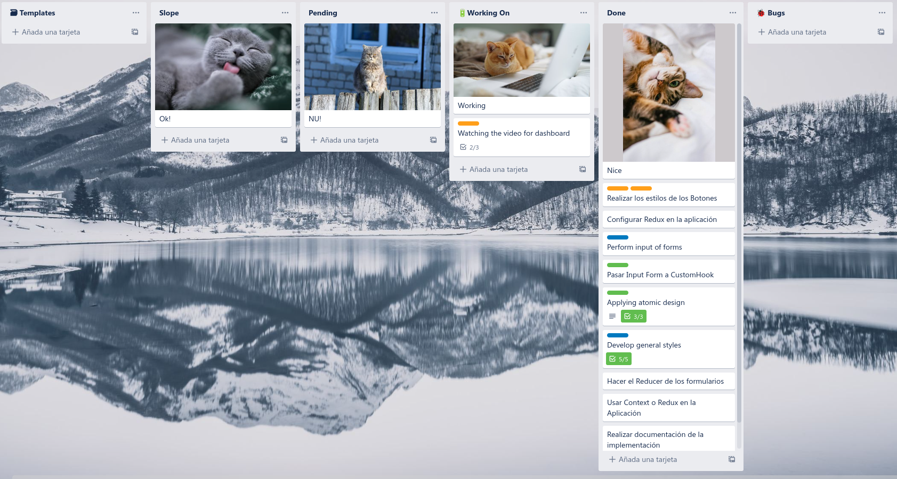

# Kanban

Se desarrolló en las empresas de Japón principalmente en Toyota, consiste en una serie de tableros visuales con posts o tarjetas pegables con las tareas, cada una maneja un estado y un ciclo de vida hasta el final de proceso. Un ejemplo de esta metodologia es la aplicación Trello.

## ¿En qué consiste?

Lo que tendremos son estados de las tareas a realizar, las mas comunes son: *Espera o Pendiente* -> *Desarrollo* -> *Terminado* 

Aunque esto puede cambiar dependiendo la forma del proyecto, en software tendremos estos estado predefinidos en los que los miembros del equipo se les iran asignando tareas. **El manager del proyecto deberá desglozar, administrar y evitar multitask** o que un solo miembro del equipo sea responsable de multiples tareas a la vez.

Esta metodología es una de las mas usadas ya que todo el equipo tiene una vista general y especifica de lo que cada miembro del grupo esta realizado de momento, al igual de cuanto demora una tarea de estar *Pendiente* a estar *Terminada* con el fin de estimar la productividad del equipo. 

Tambien se puede añadir colores a las tareas o tags para establecer prioridades, por ejemplo el color rojo sería un tarea urgente que se debe terminar en el menor tiempo posible, o el azul para tareas que pueden esperar o no requieren atención inmediata. 

## Ejemplo de tablero Kanban en Trello

## Principios ☝  

1. **Empezar por lo ya se está haciendo:** Para la facil incorporación de la metodologia se debe adaptar al tipo de proyecto a realizar.
2. **Comprometerse a buscar e implementar cambios incrementales:** Se debe analizar el proceso de trabajo para encontrar los posibles fallos y aciertos.
3. **Respetar los procesos y cargos actuales:** Como en el primer punto debemos adaptar todo el metodo a lo que ya se está implementando en el proyecto, con el fin de evitar confusiones y retrasos que demoren los procesos ya asimilados por el equipo. 
4. **Animar el liderazgo en todos los niveles:** 😏

**[<- Volver a Metodologías Agiles](000%20Metodologias%20Agiles.md)** 