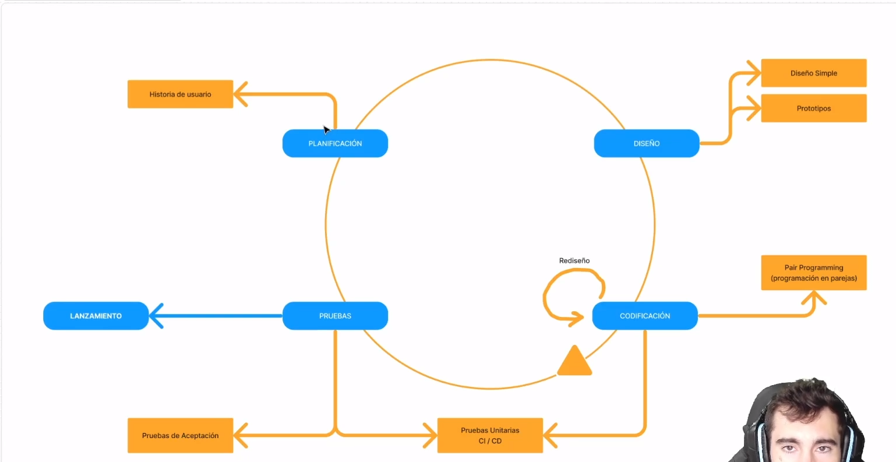

# Programación Extrema

## Valores

1. **Simplicidad:** Mantener el diseño y arquitectura del codigo lo mas simple posible. Ademas es importante que el codigo sea autodocumentado, con nombres adecuados de variables, archivos, etc y sea lo mas entendible posible.

2. **Comunicación:** Debe comentarse solo lo que no va variar, es decir todas las funcionalidades que son fijas o importantes se debe mantener una comunicación constante. Otro aspecto es Pair programming o programación en parejas que aumenta de manera significativa la calidad del software y el entendimento del grupo de desarrollo. Ademas el cliente debe trabajar junto con el equipo de desarrollo, haciendo rapidamente las correcciones o cambios que el codigo debe sufrir.

3. **Retroalimentación:** Al tener al cliente cerca podemos tener la opinión de cliente siempre en tiempo real.

4. **Coraje o valentia:** Los desarrolladores debe sentirse comodos al realizar cambios constantes que el cliente requiera. Eliminar codigo obsoleto debe ser una de las parte mas importante de nuestro software para que no quede en el olvido. Saber que en el mundo del desarrollo de software es en gran parte manejar frustaciones donde parte del codigo va tener errores o bugs que el grupo deben manejar de manera de la mejor manera, sin 'quemarse' o abrumarse sino realizando otras actividades despejando la mente de sus integrantes para posteriormente buscar una mejor solución.

5. **Respeto:** Respeto entre todos los integrantes del grupo en el proyecto.

## Fases

1. **Planificación:** Dividir el desarrollo en historias de usuario.
2. **Diseño:** El diseño debe ser simple y en prototipos o bocetos o borradores o esquemas.
3. **Codificación:** Se debe realizar esta fase en Pair Programming y se puede realizar un rediseño en la fase anterior.
4. **Pruebas:** Ejecución de pruebas unitarias a traves de integración continua, esto se puede realizar en la fase de codificación a medida que partes del software se van terminando se debe realizar test. Ademas pruebas de aceptación o UAT.
5. **Lanzamiento**

## Practicas

- **El desarrollo debe ser iterativo e incremental:** Se deben ir lanzando pequeñas versiones del software que sean funcionales.
- **Pruebas unitarias continuas:** Es necesario realizar pruebas unitarias continuas y aconseja TDD(Test Driven Development) osea que primero es desarrollar los test y despues desarrollar el software. Tambien recomienda utilizar herramientas de testeo unitario como Github Actions.
- **Pair Programming:** Desarrollo en parejas en un mismo puesto.
- **Integración del equipo de desarrollo con el cliente**
- **Corrección de todos los errores antes de una nueva funcionalidad**
- **Refactorización del codigo:** Aumentar la legibilidad y la mantenibilidad del codigo. Para esto se debe hacer pruebas de regresión con el fin de que los cambios realizados no rompan la funcionalidad, que se mantengan con el mismas carateristicas pero que mejore aspectos como el rendimiento.
- **Propiedad del codigo:** Cualquier integrante del codigo puede cambiarlo o verlo.
- **Simplicidad:** Se debe hacer lo mas simple posible e ir mejorando version en version que hacer algo complicado para que no se utilice, esto tambien permite tiempos de entrega mucho menores y viabilidad del proyecto a los clientes.

**[<- Volver a Metodologías Agiles](000%20Metodologias%20Agiles.md)** 