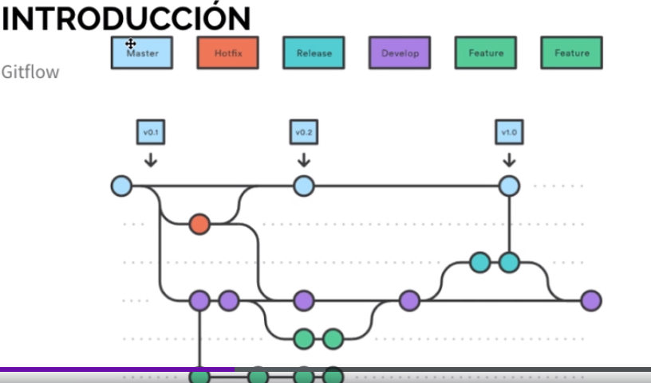

# Flujo de Trabajo en Git

Tags: Ramas

- **Tipos de Ramas**
    - **main:** Es la rama principal de proyecto.
    - **develop:** Segunda rama principal.
    - **feature:** Rama para nueva funcionalidad.
    - **bug:** errores que se presentan en el codigo.
    - **support:**
    - **realese:** rama donde se realizan todas las pruebas antes de pasar a la rama principal.
    - **hotfix:** parche de bug de producción, tambien se integra a la rama principal.

     
