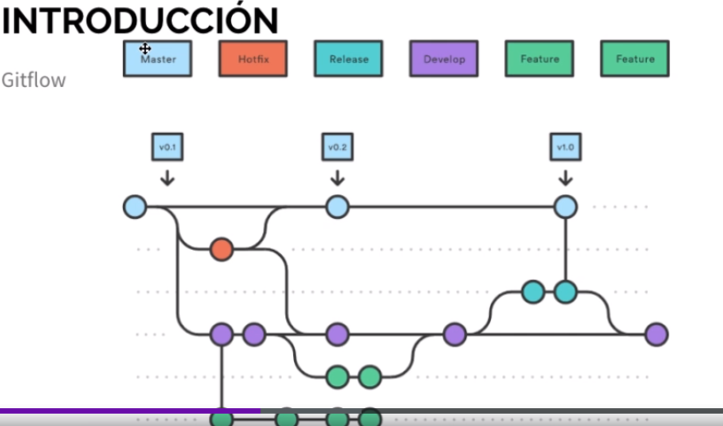

# Todo sobre Ramas

Tags: #Ramas

## Ramas

Son lineas de tiempo diferentes unas de otras, un ejemplo sería lo siguiente:

## Merge o Uniones

Son las uniones que se hacen de una rama a otra, pero antes de hacer merge, es muy recomendables realizar lo que se llama en GitHub, **pull request.** 

## Tipos de Merge

- **Fast-forward:** Es el tipo de unión es de tipo limpia sin errores, como si formaran parte de la rama principal.
- **Uniones Automáticas:** Son uniones que se realizan de forma automatica cuando no hay conflictos entre ramas.
- **Manual:** Cuando hay conflictos entre ramas que git no da para resolver, lo cual lo debemos de resolver nosotros de forma manual. Una vez resuelto se crea un nuevo commit de la unión de ambas ramas.

## ¿Como realizar el Merge en la terminal?

### Fast-forward

1. Nos ubicamos en la rama a la cual queremos traer los cambios, con **`git checkout [rama]`**
2. Luego con **`git merge [rama atraer]`**

### Manual

1. Cuando hagamos el Merge y veamos conflictos debemos resolverlos de forma manual, debe identificar los archivos en conflicto.
2. Resolvemos las lineas de codigo donde se presenten.

## Comando importantes

**`git branch [rama]`** ⇒ Crea una nueva rama

**`git checkout -b [rama]`** ⇒  Crea una nueva rama y se mueve a ella

**`git checkout [rama]`** ⇒ Cambiar de rama

**`git branch`** ⇒ Listar ramas

**`git branch -D [rama]`** ⇒ Borrar rama

**`git show-branch`** ⇒ Historial de las ramas

**`git show-branch --all`** ⇒ Historial de todas las ramas detallado

## Como realizar un Pull Request
[[Realizar un Pull Request]]