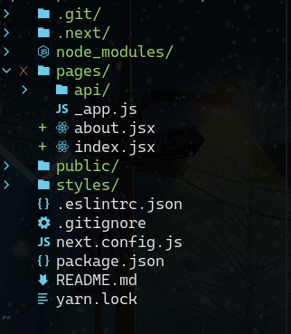

Next cuento con su propio enrutador basado en capetas y directorios, en *pages/* se puede crear cualquier archivo *js, ts,  jsx o tsx* que sera una ruta en nuestra aplicación 

Para este caso index sera la ruta */*  y about tendra la ruta */about*. De este modo se podrá crear cualquier ruta dentro de nuestra aplicación. 
Debe tener en cuenta que los nombres  de los archivos siempre van en minúscula y deben exportarse por default.

## Use Router
