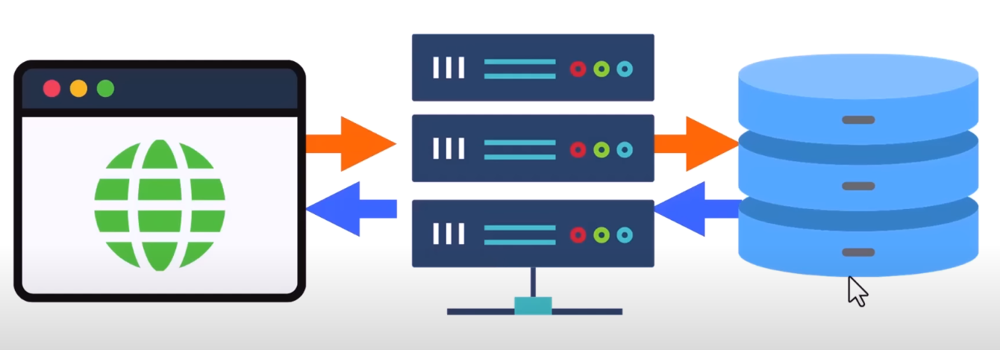

# Node

## ¿Qué es Node?

Node es basicamente javascript en el lado del servidor, corre sobre el motor V8 de chrome, trabaja traduciendo el codigo de JavaScript a lenguaje maquina. Tiene su propio sistema de paquetes npm, y es la libreria open source mas grande del mundo. 

## ¿Qué se puede hacer con Node?

- Uso de Sockets para comunicar a tiempo real cliente-servidor
- Manejo de archivos en FileSystem, cargas simultaneas.
- Servidores locales y remotos con información en tiempo real.
- Conexiones a base de datos.
- Creación de servicios REST en segundos.

## Blocking y Non Blocking I/O

Una ejecución bloqueante no es mas que un codigo sincrono, es decir, al hacer  peticiones o bucle while tiene tiempo de demora en ejecución se esperar que este termine para continuar. Por el contrario el no blocking o asicrono, no espera que la peticiones o el bucle termine para que se siga ejecutando sino que este sigue las siguientes instrucciones, esto permite una mejora en los tiempos de espera haciendo node lo suficientemente rapido. 
 **Mas Info => [Blocking or No Blocking](./001%20Blocking%20or%20No%20Blocking.md)**

## Arquitectura cliente-servidor

Es un modelo en el cual el servidor envia recursos al dispositivo que los solicita osea el cliente. Un ejemplo seria el navegador web (cliente) que solicita la validación de un usuario y contraseña en la base de datos en un servidor.

## Protocolo 

Reglas que permiten que dos entidades de una red se comuniquen, en internet el protocolo principal es el http y https, cada pagina web en el mundo debe estar encriptada su información en estos protocolos, es importante encriptar la información cliente-servidor ya en el camino la información puede ser desviada u obtenida. Imagina que estes enviando cartas y el servidor de correo la deje tiradas en el camino cualquiera puede leer la información, por esta razón se utilizan protocolos de enlace, asi tanto tu usuario y contraseña estan a salvo en el camino del enlace.  

## Modulos en Node

Funcionalidad organizada en uno o varios archivos de JavaScript que puede ser reutilizada en una aplicación. Por la complegidad de algunas aplicaciones Node nos permite importar modulos entre ellos, siendo mucho mas facil mantener las aplicaciones y paginas web, reutilizar codigo, corregir bugs y mucho más fácil de agregar nuevas funcionalidades. 
**Mas información => [002 Modulos](./002%20Modulos.md)**

## NPM

Es la libreria de software mas grande del mundo que contiene paquetes de Node.js. Se pueden crear paquetes y publicarlos directamente en los repositorios abiertos de NPM. 

**Mas información =>**  [NPM](./003%20NPM.md)