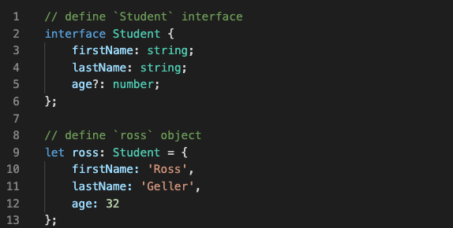

# Generalidades 

## Tipos de datos

### Booleanos

```jsx
let logico: boolean = false;
let verdadero: boolean = true;
```

Los tipos de datos se deben especificar con minuscula

### Números

```jsx
let entero: number = 44;
let decimal: number = 20.05;
let numerosLargos: number = 86_561_215_000; //86561215000
```

### Strings

```jsx
let nombre: string = 'Fabian';
```

### Any

```jsx
let cualquier: any = "Puede ser cualquier tipo de dato"
```

### Null

Al igual que en JavaScript, el tipo de datos `null` en TypeScript solo puede tener un valor válido: `null`. Una variable null no puede contener otros tipos de datos como número y cadena de texto. Establecer una variable a null borrará su contenido si tuviese alguno.

Recuerde que cuando el indicador `strictNullChecks` se configura como `true` en **tsconfig.json**, solo el valor null se puede asignar a las variables con tipo null. Este indicador está desactivado por defecto, lo que significa que también puede asignar el valor null a variables con otros tipos como `number` o `void`.

```jsx
let nada: null = null
```

### undefined

Cualquier variable cuyo valor no haya especificado se establece en `undefined`. Sin embargo, usted también puede establecer explícitamente el tipo de una variable como indefinida, como se ve en el siguiente ejemplo.

Tenga en cuenta que una variable con `type` configurado como `undefined` solo puede tener undefined como su valor. Si la opción `strictNullChecks` está configurada como `false`, también podrá asignar `undefined` a variables de tipo numérico y cadenas de texto, etc.

```jsx
let indefinido: undefined = undefined
```

### Void

El tipo de datos void se usa para indicar la falta de un `type` para una variable. Establecer variables para que tengan un tipo `void` puede no ser muy útil, pero usted puede establecer el tipo de retorno de las funciones que no devuelven nada a `void`. Cuando se usa con variables, el tipo `void` solo puede tener dos valores válidos: `null` y `undefined`.

```tsx
// With strictNullChecks set to true

let a: void = undefined;// Ok

let b: void = null; // Error

let c: void = 3; // Error`

let d: void =` `"apple"; // Error

// With strictNullChecks set to false`

let a: void = undefined; // Ok`

let b: void = null; // Ok

let c: void = 3; // Error

let d: void =` `"apple";  // Error
```

```jsx
function saludar(): void {
	
}
```

### Arrays

```jsx
let dias: string []= ["Lunes","Martes","Miercoles"]
```

### Tuplas

Tipo de dato parecido a los Arrays pero permite definir los tipos de datos y el numero de ellos dentro del mismo

```jsx
let dias_de_la_semana: [string, number, boolean] = [
	'Lunnes',
	2,
	true,
];
```

Desde la version 4.0 se puede realizar de la siguiente manera: 

```jsx
const usuario: [nombre: string, estadoCivil: string, edad: number] = [
	'Fabian',
	'Soltero',
	26,
];
```

Se puede colocar parametros a cada tipo de dato dentro de la tupla.

### Interface



Se utilizan para definir objetos mas complejos