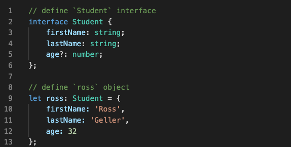

# Generalidades 

Fechas: September 12, 2021 10:58 AM
Tags: Basico
Tipos: Clase

## Tipos de datos

### Booleanos

```jsx
let logico: boolean = false;
let verdadero: boolean = true;
```

Los tipos de datos se deben especificar con minuscula

### Números

```jsx
let entero: number = 44;
let decimal: number = 20.05;
let numerosLargos: number = 86_561_215_000; //86561215000
```

### Strings

```jsx
let nombre: string = 'Fabian';
```

### Any

```jsx
let cualquier: any = "Puede ser cualquier tipo de dato"
```

### Null

```jsx
let nada: null = null
```

### undefined

```jsx
let indefinido: undefined = undefined
```

### Void

```jsx
function saludar(): void {
	
}
```

### Arrays

```jsx
let dias: string []= ["Lunes","Martes","Miercoles"]
```

### Tuplas

Tipo de dato parecido a los Arrays pero permite definir los tipos de datos y el numero de ellos dentro del mismo

```jsx
let dias_de_la_semana: [string, number, boolean] = [
	'Lunnes',
	2,
	true,
];
```

Desde la version 4.0 se puede realizar de la siguiente manera: 

```jsx
const usuario: [nombre: string, estadoCivil: string, edad: number] = [
	'Fabian',
	'Soltero',
	26,
];
```

Se puede colocar parametros a cada tipo de dato dentro de la tupla.

### Interface



Se utilizan para definir objetos mas complejos