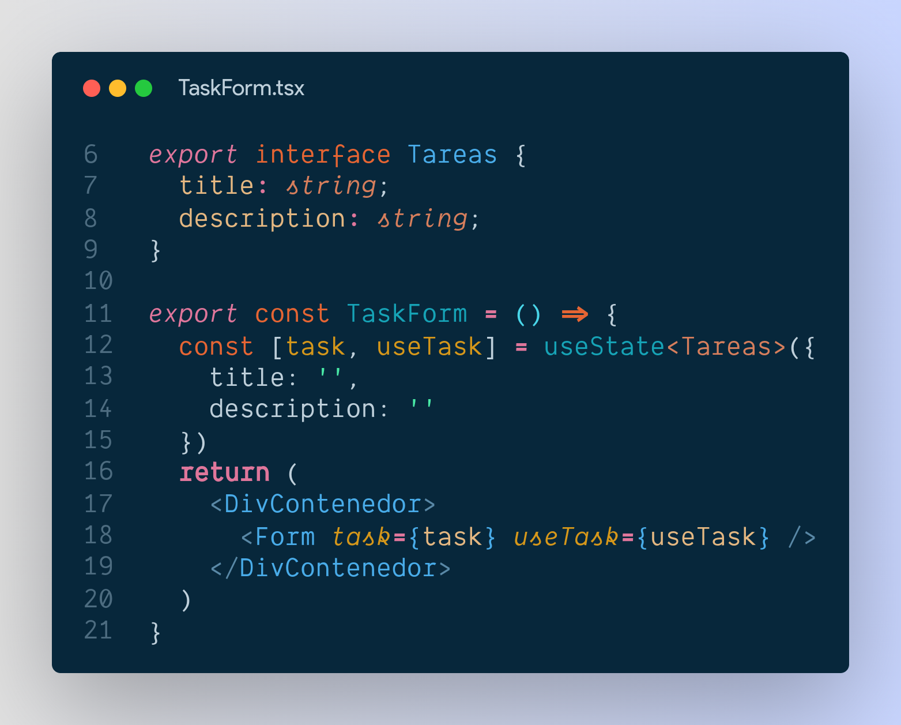
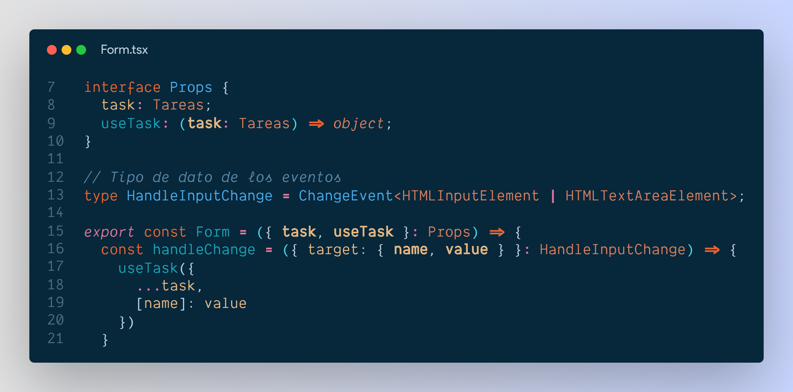
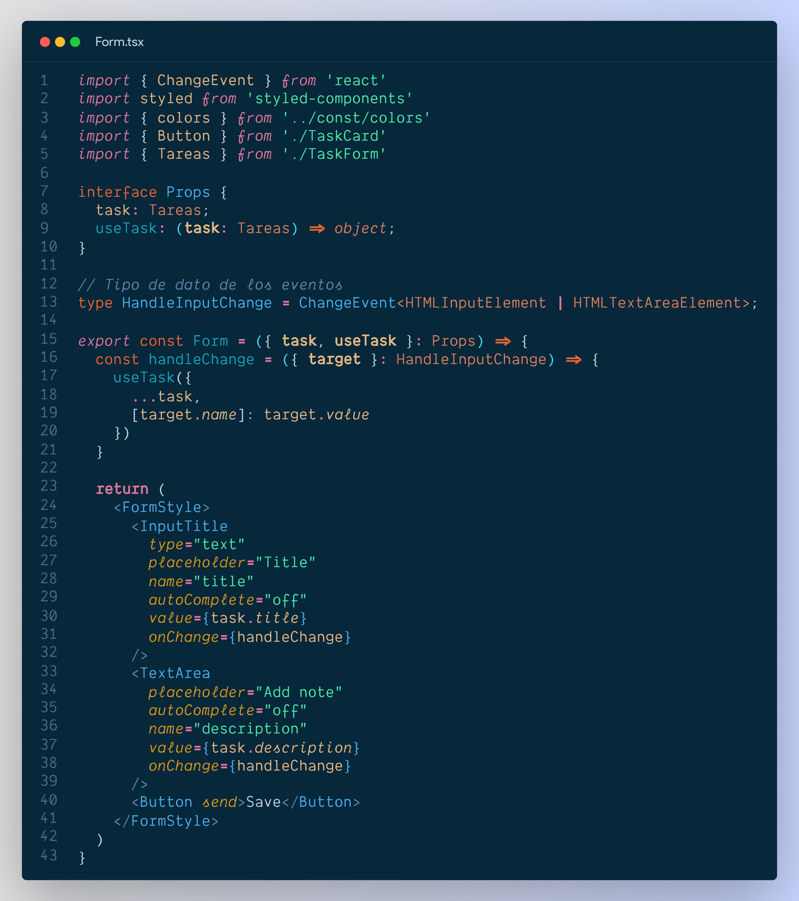

# TypeScript con React

Fechas: December 31, 2021 2:46 PM
Tipos: Clase

## Interfaces para Tipar Componentes

Uno de los propósitos para utilizar TypeScript con React es para tipar componentes y evitar errores y documentar mucho mejor nuestro código, para esto las interfaces nos ayudan a definir los tipos de datos que requiere el componente para existir, como por ejemplo:

```tsx
interface Props {
  title: string;
  subtitle: string;
}

export const App = ({ title, subtitle }: Props) => {
  return (
    <>
      <h1>Fabian es: {title}</h1>
      <p>Es el mejor de todos los {subtitle}</p>
    </>
  );
};
```

Estoy definiendo como `**interface**` **Props** se pase como argumento de la función, que este caso sea title, subtitle, ambos son propiedades que requiere el componente para existir, que son de tipo Props que esta estructurado como un objeto, por lo siguiente se desestructura con `**({ title, subtitle }: Props)**` y ya tenemos las propiedades disponibles y deben ser siempre mandadas con el tipo de dato de la inteface.

## Interfaces de estados de React

- Inicializamos el useState



Para tipar la inicialización del useState, se definió el tipo de dato por medio de una **interface** con los parametros del objeto. Con `<Tareas>` definimos el parametro de la función `useState` con la interface

- Pasamos los datos del estado por las props y hacemos el interface



Aca vemos **un interface de un useState de React** donde el useTask es una función que maneja el estado, ya definimos Tareas en el paso anterior y ahora lo llamamos para que tenga los mismos datos del inicio, asi podemos definir todo el objeto para que se cambie al pasar las props.

## Tipar eventos de los componentes

Acá tenemos un componente que contiene un formulario con input y text area respectivamente



El **`handleChange`** es el evento que va leer el value del input y textarea, entonces podemos tipar para que el evento solo se ejecute en uno o varios elementos del DOM. En este caso se realizó un type llamando **`ChangeEvent`** que nos permite definir el tipo de elementos que podran ejecutar este evento que en esta caso es un función, que se ejecuta cada vez que se cambia el input.

## Custom Hooks

**Definición**
Una forma de extraer lógica de los componentes para hacerlos mas sencillos de reutilizar.

**Pasos**

1. Crear en la carpeta `src` crear un directorio llamado **hooks**.
2. Le asignamos el nombre del archivo, en el caso de los hooks el estandar es utilizar **use** para identificarlos.

_Nota: la diferencia entre un custom hooks y un compenente es que estos ultimos no retornan jsx o html embebido._

**Ejemplo**

En el siguiente ejemplo tenemos un componente que realiza un Login y tiene varios formularios, utilizamos un CustomHook para reutilizar el cambio de estado de los formularios. 

```tsx
import { ChangeEvent } from 'react'

import { Link } from 'react-router-dom'

import { useForm } from '../../hooks/useForm'

  

interface FormData {

	email: string;
	
	password: string;

}

  

export const LoginScreen = () => {

	const { email, password, handleInputChange, reset } = useForm<FormData>({
	
		email: '',
		
		password: ''
	
	})

  

	type HandleSubmitEvent = ChangeEvent<HTMLFormElement>;

  

	const handleInputSubmit = (e: HandleSubmitEvent) => {
	
		e.preventDefault()
		
		reset()
	
	}	
	
	
	return (
	
	<>
	
	  <form onSubmit={handleInputSubmit}>

		<input
	
		  className="auth__input"
	
		  type="email"
	
		  placeholder="Email"
		
		  name="email"
	
		  autoComplete="off"
	
		  onChange={handleInputChange}
	
		  value={email}
	
		/>
	
	  
	
		<input
	
		  className="auth__input"
		
		  type="password"
		
		  placeholder="Password"
		
		  name="password"
		
		  onChange={handleInputChange}
		
		  value={password}
	
		/>
	
	  
	
		<button className="btn btn-primary mb-1" type="submit">
		
		  Login
		
		</button>

```

**¿Como realizar un Custom Hook con TypeScript? **

```tsx

import { ChangeEvent, useState } from 'react'

  

export const useForm = <T extends Object>(initialState: T) => {

//

	const [values, setValues] = useState(initialState)
	 
	
	const reset = () => {
	
		setValues(initialState)
	
	}
	
	  
	
	type HandleInputEvent = ChangeEvent<HTMLInputElement>;
	
	  
	
	const handleInputChange = ({ target }: HandleInputEvent) => {
	
	const { name, value } = target
	
	  
	
	setValues({
	
		...values,
		
		[name]: value
	
	})

}

  

return { values, handleInputChange, reset, ...values }

}
```

En el ejemplo tenemos un par de puntos de este customHook que explicar:

1. Al principio de nuestra función observamos => `export const useForm = <T extends Object>(initialState: T)`  **T extends Object** se refierer a que el parametro que se espera es de tipo Objeto y se espera siempre de manera obligatoria, esto de manera restrictiva hace que se comentan menos errores. 

2. Para tener en cuenta, este hook siempre debe recibir un objeto como parametro inicial, y se llama de la siguiente forma: 

```tsx

interface FormData {

	email: string;
	
	password: string;

}

  

export const LoginScreen = () => {

	const { email, password, handleInputChange, reset } = useForm<FormData>({
	
		email: '',
		
		password: ''
	
	})

```

3. HandleInputEvent es un tipo evento para elementos Input, como ya lo vimos arriba se tipan para saber a que elemento del HTML se refiere el evento.

### Referencias

[[React Typescript Basics]] _Buenas practicas de Typescript con React_
