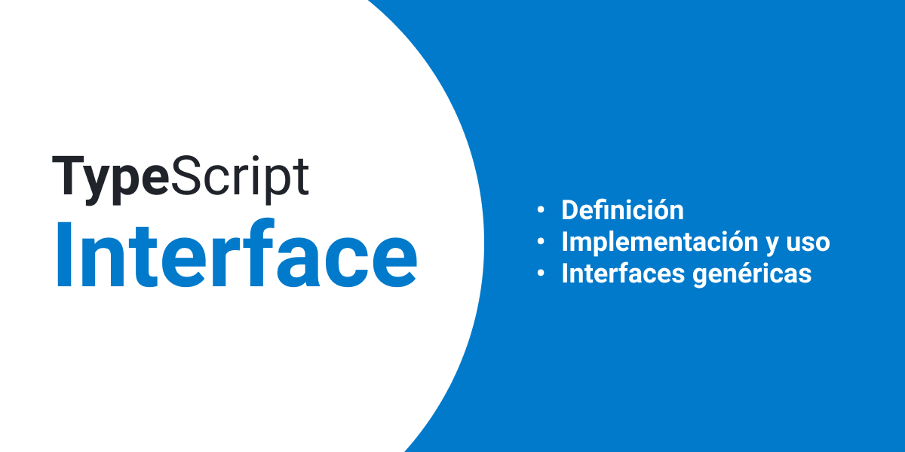

# Uso de interfaces en typescript

Fechas: January 21, 2022 2:15 AM
URL: https://forfrontend.tips/uso-de-interfaces-en-typescript

 

Una de las grandes utilidades de [TypeScript](https://forfrontend.tips/tags/typescript) es la definición de tipos estáticos. Las interfaces son una de esas herramientas nos brinda el lenguaje para la definición de tipos personalizados.

## Definición de interfaces

Para declarar una interfaz en typescript, utilizar la palabra clave `interface` seguida del nombre.

Dentro de llaves, se definen las propiedades de la interfaz.

## Propiedades opcionales

Para especificar que una propiedad de la interfaz es opcional, usar el signo de interrogación `?` al final del nombre de la propiedad. Todas las demás son obligatorias.

## Tipado de variables usando interfaces

Ya creada la interfaz podemos usarla para tipar las variables. Ya sea en otras interfaces, en variables, clases o funciones.

Para añadir tipos en typescript se añade `:` después del nombre de la variable.

Está variable es de tipo `Person`, cualquier otro valor será marcado como error por el compilador de typescript.

## Tipando funciones en una interfaz

Podemos añadir tipos a las funciones de una interfaz, para garantizar que cualquier función definida dentro de una interfaz será usada con la firma adecuada.

```
    (person; Person) => string
    (person: Person): string

```

Podemos tipar variables de tipo `PersonFullName` con una función que reciba una variable de tipo `Person` y devuelva un string.

```
const getFullName: PersonFullName = (person: Person) => {

```

Si el valor de retorno o el parámetro que recibe la función es distinto al tipado de la interfaz, el compilador marcará el error.

## Extender interfaces en typescript

En la programación orientada a objetos, es posible extender interfaces para componer otras interfaces más complejas.

Por ejemplo, tengo una `interfase` Base, que contiene las propiedades comunes de varias entidades.

Extendemos la interfaz `Person` utilizando la interfaz `Base`.

Además de extender otras interfaces, podemos extender una interfaz con una clase.

## Implementar una interface en typescript

Al igual que la mayoría de los lenguajes de programación con tipado fuerte, en typescript podemos implementar interfaces en las clases.

Para implementar una interfaz, utilizamos la palabra reservada `implements`

```
  getFullName(): string {

```

Al implementar una interfaz en una clase, typeScript obliga a añadir todas las sus propiedades.

## Interfaces genéricas

En ocaciones para ir más allá en la reutilización de interfaces, podemos utilizar interfaces genéricas. Esto nos permite recibir uno o varios tipos de datos que serán utilizados en el interior de la interfaz.

Imagina una interfaz que contiene una función que retorna una lista de tipo `T`.

De esta forma podemos añadir una lógica en la función `getList` que siempre retorne una lista con el tipo genérico que definimos en la interfaz.

Hay muchas formas de sacar partido a esta gran fucnonalidad.

## Conclusión

Las interface son de gran ayuda en timpo de desarrollo, nos ayudan a restringir el tipo de datos que asignamos a una variable. Sí, es más trabajo, pero nos ayuda a evitar errores en el desarrollo.

**Referencia**