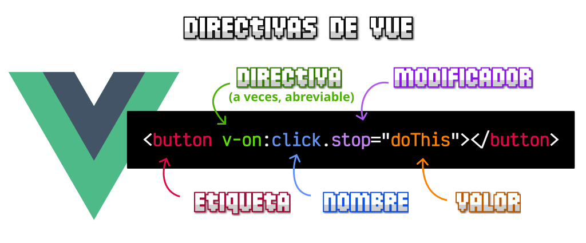
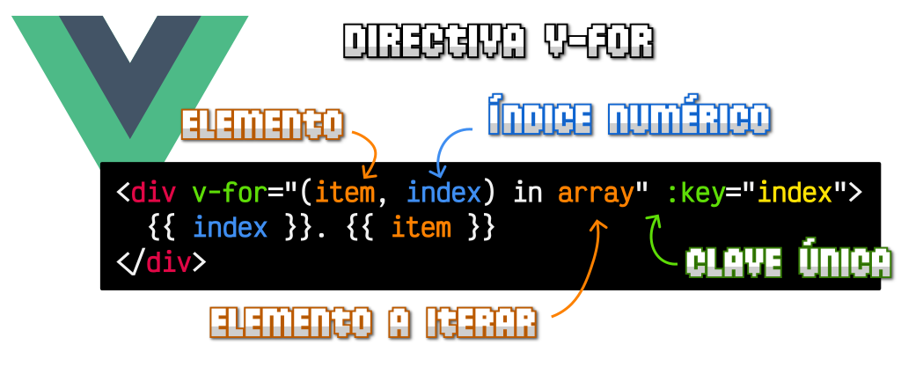

## Directivas

Las **directivas de Vue** son atributos especiales que se colocan en las etiquetas HTML y están prefijados por `v-`, como por ejemplo, `v-for`, `v-bind` o `v-on`, entre muchas otras. Estas directivas permiten realizar **acciones dinámicas potentes** (_bucles, condicionales, etc..._) que no se pueden realizar en HTML por si solo, pero que **Vue** permite utilizar en sus etiquetas `<template>`.


Dichas **directivas** están formadas por varias partes:

- **Directiva**: El nombre de la directiva, que a veces, es posible abreviarlo con un carácter.
- **Argumento**: En ciertas directivas se indica un parámetro.
- **Modificador**: En ciertas directivas se puede modificar el comportamiento.
- **Valor**: En ciertas directivas, se requiere establecer un valor. Se escribe como el valor de un atributo HTML.

### `v-on` (abreviado como `@`)

La directiva `v-on` se utiliza para escuchar eventos del DOM y ejecutar métodos en respuesta a ellos. Aquí hay un ejemplo:

```html
<button @click="handleClick">Haz clic aquí</button>
```
Mas información -> [Eventos y modificadores](./003 Eventos.md)

### [Directiva v-show](https://lenguajejs.com/vuejs/directivas-vue/v-show-y-v-if/#la-directiva-v-show)

La directiva se realiza como una directiva para mostrar u ocultar algo, dependiendo del valor boleano que tenga, si es true lo muestra, si es false lo oculta con CSS, mediante un display: none. Mejor un ejemplo:

```html
<template>
  <div>
    Usuario: Fabian
    <span v-show="login">(Identificado)</span>
  </div>
</template>

<script>
export default {
  name: "App",
  data() {
    return {
      login: true
    }
  }
}
</script>
```

En el anterior ejemplo, dado que login sea false veremos la etiqueta `<span>` dentro del DOM pero con el estilo de `display: none` que hace que no se observe.

### Directiva `v-if` 

La directiva `v-if` se utiliza para renderizar un elemento en el DOM solo si la expresión evaluada es verdadera. Por otro lado, `v-show` se utiliza para alternar la visibilidad de un elemento cambiando su estilo CSS `display`. 

**Aquí tienes un ejemplo:**
Supongamos que tienes un componente llamado `MensajeComponent.vue` que muestra un mensaje si una condición se cumple. Aquí está el código del componente:

```html
<template>
  <div>
    <p v-if="mostrarMensaje">¡Hola, mundo!</p>
    <p v-else>No hay mensaje para mostrar.</p>
  </div>
</template>

<script>
export default {
  data() {
    return {
      mostrarMensaje: true // Cambia esto a `false` para ocultar el mensaje
    };
  }
};
</script>
```


- La directiva `v-if` se utiliza para mostrar o no mostrar el elemento `<p>` basado en el valor de la variable `mostrarMensaje`.
- Si `mostrarMensaje` es `true`, el mensaje "¡Hola, mundo!" se mostrará.
- Si `mostrarMensaje` es `false`, se mostrará el mensaje "No hay mensaje para mostrar".

Puedes cambiar dinámicamente el valor de `mostrarMensaje` para controlar la visibilidad del mensaje. Por ejemplo, podrías tener un botón que cambie el valor de `mostrarMensaje` cuando se haga clic en él:

```html
<button @click="mostrarMensaje = !mostrarMensaje">Mostrar/Ocultar Mensaje</button>
```

Con este botón, cada vez que se haga clic, el valor de `mostrarMensaje` se invertirá, lo que alternará la visibilidad del mensaje en el componente `MensajeComponent`.

### Directiva `v-for`

La directiva `v-for` se utiliza para renderizar una lista de elementos basada en una matriz o un objeto. 



Nos brinda la posibilidad de crear un bucle for desde HTML
Aquí hay un ejemplo:

```html
<template>
  <div>
    <div v-for="item in array">{{ item }}</div>
  </div>
</template>

<script>
export default {
  name: "BaseBlock",
  data() {
    return {
      array: ["HTML", "CSS", "Javascript", "Terminal"],
    };
  },
};
</script>
```

### `v-bind` (abreviado como `:`)

La directiva `v-bind` se utiliza para enlazar dinámicamente un atributo de un elemento HTML a una expresión de datos en el componente. Aquí hay un ejemplo:

```html

```

### `v-model`

La directiva `v-model` se utiliza para crear enlaces bidireccionales entre datos en el componente y elementos de entrada, como inputs, selects y textareas. Aquí hay un ejemplo:

```html
<input v-model="mensaje" placeholder="Escribe algo...">
<p>{{ mensaje }}</p>
```

### `v-text` y `v-html`

Las directivas `v-text` y `v-html` se utilizan para actualizar el contenido de un elemento con texto plano o HTML renderizado dinámicamente. Aquí hay un ejemplo:

```html
<p v-text="mensaje"></p>
<div v-html="htmlString"></div>
```

Estos son solo algunos ejemplos de las directivas integradas en Vue.js. ¡Puedes combinar estas directivas de diversas formas para crear aplicaciones Vue poderosas y dinámicas!
